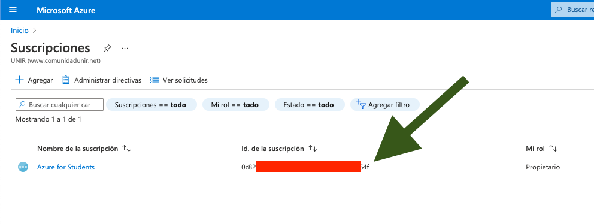

# 1. Pasos previos

En esta sección se explicará como configurar y/o obtener:
  * Configurar el cli de terraform
  * Configurar el cli de azure
  * Obtener un service principal de azure

## 1.1) Instalación de cli de terraform

Documentación oficial de cómo instalar el cli de terraform: https://learn.hashicorp.com/tutorials/terraform/install-cli

1.1.1) Instalamos (MacOS):
```
#Instalación de brew (sólo si no se tiene instalado)
$ /bin/bash -c “$(curl -fsSL https://raw.githubusercontent.com/Homebrew/install/HEAD/install.sh)"

#Instalación de terraform
$ brew tap hashicorp/tap
$ brew install hashicorp/tap/terraform
```

1.1.2) Probamos que esté instalado correctamente
```
$ terraform --version

Terraform v1.1.7
on darwin_amd64
+ provider registry.terraform.io/hashicorp/azurerm v2.46.1
+ provider registry.terraform.io/hashicorp/local v2.1.0
+ provider registry.terraform.io/hashicorp/null v3.1.0
+ provider registry.terraform.io/hashicorp/tls v3.1.0
```

## 1.2) Instalación del cli de azure

Documentación oficial de cómo instalar el cli de azure: https://docs.microsoft.com/es-es/cli/azure/install-azure-cli

1.2.1) Instalamos (MacOS):
```
# Partiendo de que se tiene brew instalado (paso anterior), descargamos el cli de azure
$ brew update && brew install azure-cli
```

1.2.2) Probamos que esté instalado correctamente
```
$ $ az --version
azure-cli                         2.33.1 *

core                              2.33.1 *
telemetry                          1.0.6

Dependencies:
msal                              1.16.0
azure-mgmt-resource               20.0.0
```

## 1.3) Obtención del Subscription id y Service Principal de azure

1.3.1) Ejecutar el siguiente comando:
```
az login
```

Se abrirá un navegador para iniciar sesión, iniciamos sesión con nuestra cuenta de azure

1.3.2) Dirigirse a la url: https://portal.azure.com/#blade/Microsoft_Azure_Billing/SubscriptionsBlade



Guardamos el **id de subscripción** (en el ejemplo 0c8d***4f).

1.3.3) Establecemos el id de subscripción en el cli de azure:
```
$ az account set --subscription="<id de subscripción>"
```
1.3.4) Creamos el service principal
```
$ az ad sp create-for-rbac --role="Contributor"
Creating 'Contributor' role assignment under scope '/subscriptions/b12b6cba-621c-4f49-8a70-a7f2e2f233ea'
  Retrying role assignment creation: 1/36
The output includes credentials that you must protect. Be sure that you do not include these credentials in your code or check the credentials into your source control. For more information, see https://aka.ms/azadsp-cli
{
  "appId": "97c**********************b99d",
  "displayName": "azure-**********************13-59",
  "name": "http://azure**********************3-59",
  "password": "GU2K**********************G1A6c",
  "tenant": "f8389**********************94a1e9119"
}
```
_(anotamos esta información porque la necesitaremos más adelante)_


## 1.4) Obtención del cliente de GIT y clonado del proyecto

Documentación oficial sobre la obtención del cliente de git: https://git-scm.com/download/

1.4.1) Instalación del cliente GIT (MacOs):
```
# Partiendo de que se tiene brew instalado (paso anterior), descargamos el cli de git
$ brew install git
```

1.4.2) Clonamos el proyecto en donde consideremos adecuado
```
# Preparamos el workspace
$ mkdir -p ~/workspace/
$ cd ~/workspace

# Clonamos el proyecto
$ git clone https://github.com/charlotron/unir-cp2.git

# Nos vamos al directorio del proyecto clonado
$ cd unir-cp2
$ ls -l

total 16
-rw-r--r--   1 someuser  somegroup  4123 11 mar 19:03 README.md
drwxr-xr-x  10 someuser  somegroup   320 11 mar 19:35 ansible
drwxr-xr-x   6 someuser  somegroup   192 11 mar 19:42 doc
drwxr-xr-x   6 someuser  somegroup   192  4 mar 16:41 kubernetes
drwxr-xr-x  12 someuser  somegroup   384 11 mar 19:35 ssh_scripts
drwxr-xr-x  19 someuser  somegroup   608 11 mar 19:38 terraform
```