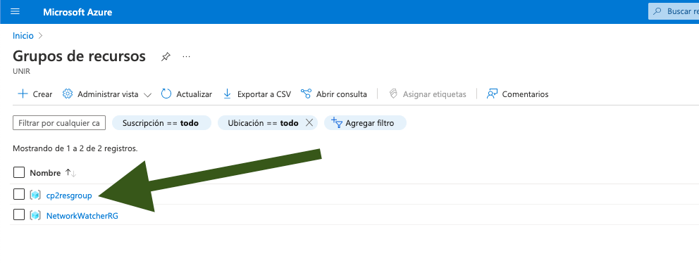
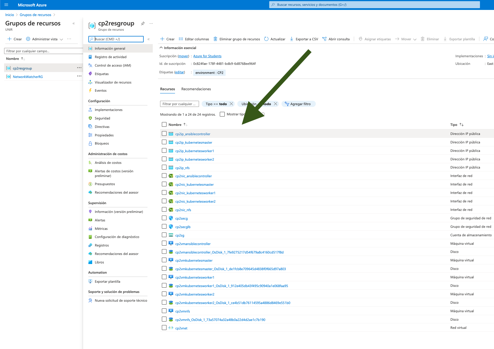

# 2. Creación de la infraestructura en Azure con Terraform

En esta sección se explicará como configurar y/o obtener:
  * Configurar datos de azure para despliegue con terraform
  * Creación de infraestructura de azure

## Pasos a seguir:

### 2.1) Configuración de fichero ".env" con los datos del service principal

En el apartado "_1.3) Obtención del Subscription id y Service Principal de azure_" se obtuvo la información requerida en este paso en los pasos previos [(doc/1.PASOS_PREVIOS.md - Pasos previos)](doc/1.PASOS_PREVIOS.md)

Generar fichero ".env":
```
# Vamos al directorio de terraform del proyecto clonado
$ cd ~/workspace/unir-cp2/terraform

# Creamos el fichero .env ejecutando el siguiente comando (NOTA: cambia los datos entre <> con los datos de tu suscripción y service principal)
$ echo '
TF_VAR_subscription_data_subscription_id  = <SUBSCRIPCION_ID>
TF_VAR_subscription_data_client_id        = <APP_ID>
TF_VAR_subscription_data_client_secret    = <PASSWORD>
TF_VAR_subscription_data_tenant_id        = <TENANT>' > .env
```

Rellenaremos los campos de la siguiente manera:
* TF_VAR_subscription_data_subscription_id = Id de subscripción obtenida en el punto "1.3.2"
* TF_VAR_subscription_data_client_id = Campo "appId" del service principal 
* TF_VAR_subscription_data_client_secret = Campo "password" del service principal
* TF_VAR_subscription_data_tenant_id = Campo "tenant" del service principal

### 2.2) Inicializar dependencias de terraform

Ejecutar el comando
```
$ terraform init
```

(se descargarán todas las dependencias, esto sólo hay que hacerlo la primera vez que se baja el proyecto)

### 2.3) Desplegar el entorno en azure

Ejecutar el comando:
```
$ ./terraform-apply.sh

[..]
null_resource.ansiblecontrollercfg["ansiblecontroller"] (remote-exec): (output suppressed due to sensitive value in config)
null_resource.ansiblecontrollercfg["ansiblecontroller"] (remote-exec): (output suppressed due to sensitive value in config)
null_resource.ansiblecontrollercfg["ansiblecontroller"]: Still creating... [2m40s elapsed]
null_resource.ansiblecontrollercfg["ansiblecontroller"]: Still creating... [2m50s elapsed]
null_resource.ansiblecontrollercfg["ansiblecontroller"]: Still creating... [3m0s elapsed]
null_resource.ansiblecontrollercfg["ansiblecontroller"] (remote-exec): (output suppressed due to sensitive value in config)
null_resource.ansiblecontrollercfg["ansiblecontroller"]: Still creating... [3m10s elapsed]
null_resource.ansiblecontrollercfg["ansiblecontroller"]: Creation complete after 3m11s [id=3776583591264396542]

Apply complete! Resources: 33 added, 0 changed, 0 destroyed.

Outputs:

public_ip_address = {
  "ansiblecontroller.local" = "20.***.***.96"
  "master.local" = "20.***.***.102"
  "nfs.local" = "20.***.***.113"
  "worker1.local" = "20.***.***.181"
  "worker2.local" = "20.***.***.199"
}
```
_(Esperamos a ver una salida similar y nos aseguramos que no ha habido fallos por el camino)_

Explicación del comando:
 1. Carga las variables de entorno del fichero .env
 2. Ejecuta terraform apply y lanza el despliegue

### 2.4) (Opcional) Comprobar que todo funciona correctamente

#### 2.4.1) Ver en azure si se ha desplegado correctamente

Ir a azure y listar el grupo de recursos "cp2resgroup" (https://portal.azure.com/#blade/HubsExtension/BrowseResourceGroups)




(Vemos que todos los recursos se han creado correctamente)

#### 2.4.2) Se generaron los ficheros "ansible/hosts" y "ssh_scripts/.env"

##### 2.4.2.1) Fichero "ansible/hosts"

Ejecutamos el siguiente comando y vemos que existe y está bien rellenado:
```
$ cat ../ssh_scripts/.env

#This file has been generated with "ansible-inventory-generation.tf"
ansiblecontroller=20.***.***.111
kubernetesmaster=20.***.***.146
kubernetesworker1=20.***.***.127
kubernetesworker2=20.***.***.241
nfs=20.***.***.52
```
_(Vemos que el fichero existe y se han generado la asignación variable=ip)_

##### 2.4.2.2) Fichero "ssh_scripts/.env"

Ejecutamos el siguiente comando y vemos que existe y está bien rellenado:
```
$ cat ../ansible/hosts

#This file has been generated with "ansible-inventory-generation.tf"
[all:vars]
ansible_user=ansible

[master]
master.local ansible_host=20.***.***.146 local_ip=10.10.10.20

[workers]
worker1.local ansible_host=20.***.***.127 local_ip=10.10.10.30
worker2.local ansible_host=20.***.***.241 local_ip=10.10.10.31

[nfs]
nfs.local ansible_host=20.***.***.52 local_ip=10.10.10.40
```
_(Vemos que el fichero existe y se han generado con la estructura similar a la mostrada de ejemplo)_

## Otras acciones

### Cómo destruir la infraestructura

Ejecutar el comando:
```
$ ./terraform-destroy.sh
```

### Cómo volver a re-desplegar la infraestructura

Ejecutar el comando:
```
$ ./terraform-redeploy.sh
```