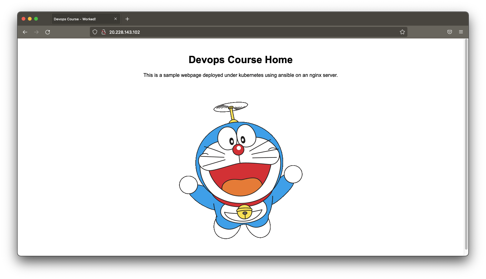

# 3. Configuración de Máquinas Virtuales (VMs) usando ansible 

Es necesario que se hayan realizado el paso "2. Creación de la infraestructura en Azure con Terraform" 

En esta sección se explicará cómo configurar las máquinas virtuales con ansible, que realizará de forma automática las siguientes tareas:
  * Configuraciones comunes de las máquinas (fichero hosts, cliente ntp, desactivación de ram, etc..)
  * Configuración de servidor nfs
  * Instalación de kubernetes, snd e ingress
  * Creación de cluster de kubernetes y la unión de nodos worker
  * Despliegue de pods, servicios, ingress, etc.. en el cluster de kubernetes
  * Despliegue de nginx como balanceador de carga para emular un enrutador cloud.

## Pasos a seguir:

### 3.1) Copiar de ficheros necesarios al "ansible_controller"

Ejecutamos lo siguiente:
```
# Vamos al directorio ssh_scripts del proyecto clonado
$ cd ~/workspace/unir-cp2/ssh_scripts

# Ejecutamos el script de sincronización de ficheros hacia el ansible controller
$ ./update-ansible-controller-with-files.sh

===== INITIAL SYNC
Exporting ENV vars:
 - ansiblecontroller
 - kubernetesmaster
 - kubernetesworker1
 - kubernetesworker2
 - nfs
building file list ... done

sent 556 bytes  received 20 bytes  230.40 bytes/sec
total size is 23830  speedup is 41.37
building file list ... done

sent 366 bytes  received 20 bytes  257.33 bytes/sec
total size is 2683  speedup is 6.95
finished.
```
_(Se verá como se copian una serie de ficheros a la máquina remota)_

### 3.2) Conexión a la máquina remota "ansible_controller"

Ejecutamos lo siguiente para conectarnos remotamente:
```
# Ejecutamos el script de conexión a la vm ansible-controller
$ ./ssh-ansible_controler.sh 

Exporting ENV vars:
 - ansiblecontroller
 - kubernetesmaster
 - kubernetesworker1
 - kubernetesworker2
 - nfs
Connecting to host via ssh: 20.****.****.111
Welcome to Ubuntu 20.04.2 LTS (GNU/Linux 5.4.0-1047-azure x86_64)

 * Documentation:  https://help.ubuntu.com
 * Management:     https://landscape.canonical.com
 * Support:        https://ubuntu.com/advantage

  System information as of Fri Mar 11 18:18:46 UTC 2022

  System load:  0.0               Processes:             111
  Usage of /:   7.1% of 28.90GB   Users logged in:       0
  Memory usage: 38%               IPv4 address for eth0: 10.10.10.10
  Swap usage:   0%


171 updates can be applied immediately.
95 of these updates are standard security updates.
To see these additional updates run: apt list --upgradable


Last login: Fri Mar 11 15:59:51 2022 from 79.144.130.40
ansible@cp2vmansiblecontroller:~$
```
_(estaremos conectados a la máquina "ansible_controller")_

### 3.3) Vemos que el ansible_controller puede conectar con ansible al resto de máquinas virtuales

Ejecutamos lo siguiente:
```
# Vamos al directorio de ansible
$ cd ~/ansible/

# Probamos la conexión
$ ./ping.sh 

master.local | SUCCESS => {
    "ansible_facts": {
        "discovered_interpreter_python": "/usr/bin/python3"
    },
    "changed": false,
    "ping": "pong"
}
nfs.local | SUCCESS => {
    "ansible_facts": {
        "discovered_interpreter_python": "/usr/bin/python3"
    },
    "changed": false,
    "ping": "pong"
}
worker2.local | SUCCESS => {
    "ansible_facts": {
        "discovered_interpreter_python": "/usr/bin/python3"
    },
    "changed": false,
    "ping": "pong"
}
worker1.local | SUCCESS => {
    "ansible_facts": {
        "discovered_interpreter_python": "/usr/bin/python3"
    },
    "changed": false,
    "ping": "pong"
}
```
_(verificamos que todas las máquinas devuelven "SUCCESS")_

### 3.4) Ejecución del playbook de ansible en la máquina remota

Ejecutamos lo siguiente:
```
# Ejecutamos el playbook de ansible ejecutando el fichero deploy.sh
$ ./deploy.sh

[...]

TASK [Create base file for nginx] *********************************************************************************************************************************************************************************************************
changed: [master.local] => {"changed": true, "checksum": "8d18b43d403216b5de481d0d5275271acb7ee0e3", "dest": "/etc/nginx/sites-available/default", "gid": 0, "group": "root", "md5sum": "072a831b0ffce5cdd1e5a45199793c98", "mode": "0644", "owner": "root", "size": 481, "src": "/home/ansible/.ansible/tmp/ansible-tmp-1647024803.7752082-24561-260586279402463/source", "state": "file", "uid": 0}

TASK [Restart nginx service] **************************************************************************************************************************************************************************************************************
changed: [master.local] => {"changed": true, "cmd": "systemctl restart nginx", "delta": "0:00:00.131134", "end": "2022-03-11 18:53:25.321417", "msg": "", "rc": 0, "start": "2022-03-11 18:53:25.190283", "stderr": "", "stderr_lines": [], "stdout": "", "stdout_lines": []}

TASK [FINISHED! Show url] *****************************************************************************************************************************************************************************************************************
ok: [master.local] => {
    "msg": "You can access the app using the following url <http://20.***.****.102>"
}

PLAY RECAP ********************************************************************************************************************************************************************************************************************************
master.local               : ok=5    changed=3    unreachable=0    failed=0    skipped=0    rescued=0    ignored=0 
```
_(vemos que no haya fallado por el camino)_

### 3.5) Comprobar que el despliegue ha sido correcto

Al finalizar la ejecución del proceso se muestra un mensaje indicando una url, dicha url apunta a los siguientes recursos:
    - IP pública de nodo master de kubernetes
    - Nginx (balanceador) del master de kubernetes en puerto 80
    - Lo recoge el ingress, que lo enruta al servicio de los pods
    - Uno de los pods responde con un html (el pod es un servidor web con un fichero estático index.html)

Para probar que todo funciona correctamente abrimos en un navegador la url indicada:



## Otras comprobaciones

Nos conectamos al nodo "master" vía ssh:
```
# Vamos al directorio ssh_scripts del proyecto clonado
$ cd ~/workspace/unir-cp2/ssh_scripts

# Nos conectamos al nodo master
$ ./ssh-ansible_slave-kubernetes_master.sh 
Exporting ENV vars:
 - ansiblecontroller
 - kubernetesmaster
 - kubernetesworker1
 - kubernetesworker2
 - nfs
Connecting to host via ssh: 20.228.143.102
Warning: Permanently added '20.228.143.102' (ECDSA) to the list of known hosts.
Welcome to Ubuntu 20.04.2 LTS (GNU/Linux 5.4.0-1047-azure x86_64)

 * Documentation:  https://help.ubuntu.com
 * Management:     https://landscape.canonical.com
 * Support:        https://ubuntu.com/advantage

  System information as of Fri Mar 11 19:02:51 UTC 2022

  System load:  0.05               Users logged in:          0
  Usage of /:   13.9% of 28.90GB   IPv4 address for docker0: 172.17.0.1
  Memory usage: 18%                IPv4 address for eth0:    10.10.10.20
  Swap usage:   0%                 IPv4 address for tunl0:   10.10.100.128
  Processes:    196

 * Super-optimized for small spaces - read how we shrank the memory
   footprint of MicroK8s to make it the smallest full K8s around.

   https://ubuntu.com/blog/microk8s-memory-optimisation

174 updates can be applied immediately.
95 of these updates are standard security updates.
To see these additional updates run: apt list --upgradable


Last login: Fri Mar 11 18:53:25 2022 from 20.228.143.96
ansible@master:~$ 
```

### Kubernetes: ver estado de los nodos del cluster
```
# Vemos que todos los nodos están conectados
$ sudo kubectl get nodes

NAME            STATUS   ROLES                  AGE    VERSION
master.local    Ready    control-plane,master   2m2s   v1.23.4
worker1.local   Ready    <none>                 41s    v1.23.4
worker2.local   Ready    <none>                 20s    v1.23.4
```
_(verificamos que todos los nodos están como "Ready")_

### Kubernetes: ver estado de los pods del cluster y que está desplegados por los nodos
```
# Consultamos los pods desplegados en el cluster
$ sudo kubectl get pods -o wide

NAME                       READY   STATUS    RESTARTS   AGE   IP             NODE            NOMINATED NODE   READINESS GATES
web-pod-67df976d44-4dbzp   1/1     Running   0          10m   10.10.100.67   worker2.local   <none>           <none>
web-pod-67df976d44-hvs24   1/1     Running   0          10m   10.10.100.68   worker2.local   <none>           <none>
web-pod-67df976d44-kwf7g   1/1     Running   0          10m   10.10.100.65   worker1.local   <none>           <none>
web-pod-67df976d44-wxxvf   1/1     Running   0          10m   10.10.100.66   worker1.local   <none>           <none>
```
_(vemos que hay 4 pods en ejecución)_

### Kubernetes: ver estado de los servicios y puerto del ingress ("haproxy")
```
# Consultamos los servicios disponibles en el cluster
$ sudo kubectl get svc -A -o wide

NAMESPACE            NAME                                         TYPE        CLUSTER-IP       EXTERNAL-IP   PORT(S)                                     AGE     SELECTOR
default              kubernetes                                   ClusterIP   10.96.0.1        <none>        443/TCP                                     4m5s    <none>
default              web-svc                                      ClusterIP   10.103.203.210   <none>        80/TCP                                      3m29s   app=web-pod
haproxy-controller   haproxy-kubernetes-ingress                   NodePort    10.103.199.49    <none>        80:32389/TCP,443:30400/TCP,1024:30887/TCP   3m58s   run=haproxy-ingress
haproxy-controller   haproxy-kubernetes-ingress-default-backend   ClusterIP   10.104.159.144   <none>        8080/TCP                                    3m58s   run=ingress-default-backend
kube-system          kube-dns                                     ClusterIP   10.96.0.10       <none>        53/UDP,53/TCP,9153/TCP                      4m3s    k8s-app=kube-dns
```
_(Vemos que hay varios servicios activos, en especial web-svc que es el servicio de los pods y el ingress "haproxy-kubernetes-ingress", nos fijamos en el puerto 80:3XXXXX que será el puerto de escucha del ingress)_

### Kubernetes: ver estado de los volumenes persistentes montados
```
# Consultamos los servicios disponibles en el cluster
$ sudo kubectl get pvc -A -o wide
NAMESPACE   NAME          STATUS   VOLUME       CAPACITY   ACCESS MODES   STORAGECLASS   AGE     VOLUMEMODE
default     web-nfs-pvc   Bound    web-nfs-pv   10Gi       RWX            nfs            8m22s   Filesystem
```
_(Vemos que hay un volumen asociado a los pods y especialmente que el estado sea "Bound" <que se ha montado correctamente>)_
